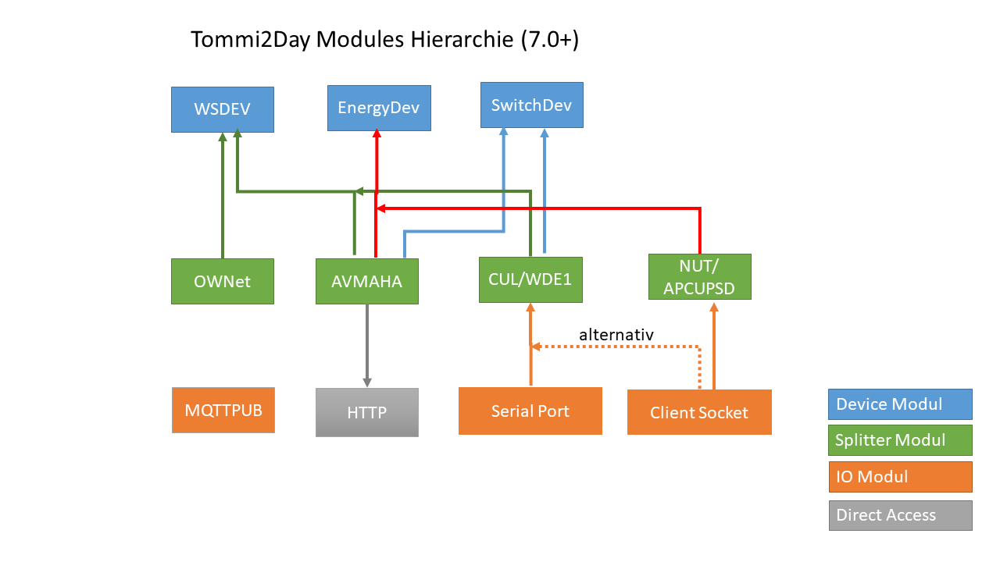

# ipsymcon-phpmodule
PHPModules for Symcon V7+

This is a Library of PHP Modules for the home automation software "Symcon"


### Requirements:
* Symcon (https://www.symcon.de/en/) Version 7.0+ (PHP8.2)
  (most modules are known working from Version 5.1, but then use the specific branch)

### Installation
* Within Symcon Konsole go to `Kern Instancen->Modules`
* Press "Hinzufügen" Button
* Enter Module Repository "https://github.com/Tommi2Day/ipsymcon-phpmodule-by-Tommi.git"
* Click on "Edit" Icon and change Branch(Zweig) to `7.0`

### Modules provides in this library:

 


### Weather Device
Generic Device module to present weather data

Prefix: WSD_

### Energy Device
Generic Device module to present energy data

##### Prefix: END_

### Switch Device
Generic Device module to present weather data

##### Prefix: SWD_

##### Public Functions:

forward data to splitter only, real actor control will need a Splitter with matching capabilities like AVMAHA or CUL

* SWD_SetSwitchMode($id,$state): set the switch to the desired state
* SWD_SetIntensity($id,$percent): Dim to the given level
* SWD_SetDuration($id,$seconds,$action=null): (FS20 via CUL only)  Switch to the given or opposite current state and reverse after time expires
* SWD_DimUp($id): Dim one Level(Step) Up
* SWD_DimDown($id): Dim one Level(Step) down

### AVMAHA

AVM AHA-API IPSymcon PHP Splitter Module Class

read AVM AHA Smarthome Services from Fritz!OS (Fritz!Box etc.)

##### supported Devices: 
* Fritz Powerline 546E
* Fritz Dect200 Switch: need FritzOS6.20+ for Temperature, 6.98 for Voltage 
* Fritz Repeater 100: need FritzOS6.50+
* Fritz Dect301 Heating: show Temperature and battery, no heating control implemented, need FritzOS 7.08+
* Fritz Dect400 Button: lastpressed Timestamp as SwitchDev and Batttery), need FritzOS 7.08+

##### Data Handling:
* Power measures will be displayed in an Energey Device instance
* Temperature mesures will be displayed in a Weather Sensor Device instance
* Switch status will be displayed in a Switch Device instance.

##### Actions:
 * Switching of capable Devices like DECT!200 and Fritz!Powerline 546.
Changes on the status will be transmitted to the connected actor

##### Prefix: AHA_


### NUT
Splittermodul to query a NUT daemon for attached UPS/USV

##### supported Devices:
Any via NUT accessible UPS/USV.

##### Data Handling:
The Data will be presented as Energy Device instances
  The DeviceID should be supplied via ups.serial field. The Status Variable refers to the ups.status field.
  For explanation see
 http://networkupstools.org/documentation.html

##### Prefix: NUT_

### APCUPSD
Splittermodul to query an APCUPSD daemon for attached UPS/USV

##### supported Devices:
Any via APCUPSD accessible UPS/USV.

##### Data Handling:
The Data will be presented as Energy Device instances
  The DeviceID should be supplied via ups.serial field. The Status Variable refers to the ups.status field.
  For explanation see
 http://www.apcupsd.org/manual/manual.html

##### Prefix: APCUPSD_

### CUL

CUL IPSymcon PHP Splitter Module Class

<span style="color:red">
This module is deprecated/unsupported as of 2022. I dont have this anymore.
</span>

receives Data from a CULFW driven tranceiver gadget like Busware
These devices receives and decodes a lot of common smarthome protocols used by ELV Sensors and devices
supported Receivers may be connect to a serial port or client socket instance. You must create such one for
your CUL instance as parent for yourself

##### supported Devices:
* Receivers: CUL,CUN,CUNO,COC

##### decoded Protocols

 * ELV EM1000: Energy Messures EM-WZ, EM-GZ and EMEM
 * ELV FS20: Any TFK and Switch actor. Dimmer are implemented, but because lack of such device untested
 * ELV HMS: HMS100T(also used as Emulation for connected 1Wire DS1820 Sensors), HMS100TF,HMS100-TFK ...
 * ELV WS300: S300TH,PS50,KS300 Weather Sensors
 * ELV FHT: TFK  Window opening Sensor only. FHT Heating Controls like FHT80b are not implemented!
 * ELV ESA: some of the Energy Sensors. see source code. Untested!

##### Data Handling:
* Power measures will be displayed in an Energey Device instance
* Temperature mesures will be displayed in a Weather Sensor Device instance
* Switch status will be displayed in a Switch Device instance. Changes on the status will be transmitted to the connected actor

##### Actions:
 * Switching of FS20 Devices.
 Changes of the status variable will be transmitted to the connected actor

##### Prefix: CUL_

##### IPS Device module learning

Its important for the proper creation of IPS devices these must be received from the CUx Splitter
instead of manually created. Only this ensures a set of valid parameters. As example a FS20 dimming device must 
be created by receiving a dimming command apply the dimming functions, otherwise it will left as a switch.
You may use your remote control or a learning procedure for this. as an alternative, you may create a valid CUL
response string and send this manually to the CUL splitter. This procedure is described in this forum entry 
https://www.symcon.de/forum/threads/31352-neue-PHP-Module-als-Ersatz-meiner-Delphi-Module?p=303129#post303129 (in german)

see http://culfw.de/commandref.html for valid CUL response strings


### OWNet

Splittermodule to query a 1Wire Device connected to server running OWServer with OWNet API

##### Supported Devices:
* DS18B20, DS18S20, DS1820 temperature sensors

##### Data Handling:
The Temperature sensors will be presented as weather devices

##### Prefix: OWN_
For more details about OWServer see
http://owfs.org/index.php?page=owserver

### MQTTPUB

IOModule to publish IPS Variable updates to an MQTT brocker

The module allows subscriptions of IPS Variable update messages and forwards this as json record to 
a MQTT broker. An external client may subscribe to these broker messages and proceed further 

##### Prefix: MQTTPUB_

##### Public Functions:
* MQTTPUP_Publish($id,$varid): trigger immediately publishing variable $varid to the broker 
* MQTTPUB_Subscribe($id,$varid): Subscribes VM_UPDATE messages for variable $varid on IPS Messageloop
* MQTTPUB_UnSubscribe($id,$varid): UnSubscribes VM_UPDATE messages for variable $varid from IPS Messageloop
* MQTTPUB_Subscribe_All($id,$objectid,$ident=null): Subscribes all variable IDs below $objectid to IPS Messageloop,
optionally only thus equal which supplied ident
* MQTTPUB_UnSubscribe_ALL($id,$objectid,$ident=null): UnSubscribes all variable IDs below $objectid from IPS Messageloop,
optionally only thus equal which supplied ident 

##### MQTT Topic:
The topic may be configured with config dialog window. You may set template variables within definition
 ```
 IPS/status/%varid%/%varident%/%path%
 ```
will result in
```
IPS/status/42440/Watt/APCUPSD_Devices/Back-UPS_RS_900G/Watt
```
##### Payload:
Payload is a Json string with the following components:
* Path: IPS tree of names from root to the variable
* TS: Unix Timestamp message received in MQTTPUB module
* UTF8Value: stringyfied actual value of variable
* VariableChanged: VariableChange Field of variable object
* VariableIdent: Ident of variable
* VariableType: VariableType Field of variable object
* VariableUpdated: VariableUpdated Field of variable object
```
{'Path': 'APCUPSD Devices/Back-UPS RS 900G/Watt',
 'TS': 1477132802,
 'UTF8Value': '124',
 'VariableChanged': 1477132502,
 'VariableID': 42440,
 'VariableIdent': 'Watt',
 'VariableType': 2,
 'VariableUpdated': 1477132802}
 ```
##### Sample consumer script
you can retrieve the published data from MQTT with simple scripts. A sample python script 
[ips_mqtt2db.py](MQTTPUB/ips_mqtt2db.py) 
demonstrates how to write the payload into a mysql database

How to use:
 * create mysql account and database.
 * Grant "Create table, Insert,update,delete,index " or simple "All" on <database>
 * check if you can connect
 * create a configuration file in YAML format somewhere with the needed credentials and adjust the values.
 
   ```
    mysql:
        host: localhost
        user: ips
        passwd: secret
        db: ips
    mqtt:
        host: localhost
        port: 1883
        topic: IPS/status/#
   ```
   
 * install required additional pip libraries:
  ```
  paho_mqtt
  MySQL-python
  PyYAML
  ```

 * now call the script
   ```
    python ips_mqtt2db.py <configfilename>
   ```
   or if the configfile is named ips_mqtt2db.yml and in the same directory
   ```
   python ips_mqtt2db.py
   ```


#### Debug:
By activating the Instance Debug Tab a lot of noise will appear

#### additional documentation
You may generate additional documentation using <a href="https://www.doxygen.nl/index.html"> Doxygen</a> 
in `docs/doc_module/html`
<pre>
cd libs/doc/
doxygen ./Doxyfile 
</pre>
see [generated output](http://www.tdressler.net/ipsymcon/docs/doc_module/html/)

#### see also
* [IPS_JSON Wrapper API](libs/Api)

### License:
CC By-NC 4.0 (http://creativecommons.org/licenses/by-nc/4.0/)
